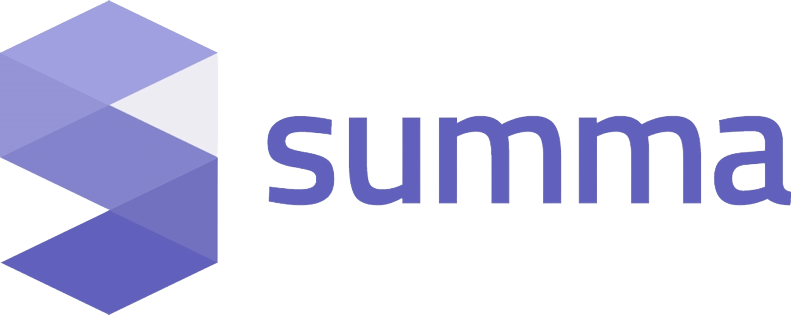

# Presentaciones de 2º DAW y 2º DAM del curso 2021 / 2022

Horarios, índices a los repositorios de alumnos y normas para las presentaciones del PFC (Proyecto fin de ciclo) de **2º DAM** (Desarrollo de Aplicaciones Multiplataforma) y **2º DAW** (Desarrollo de Aplicaciones Web) del **IES Campanillas** (Málaga) del curso 2021 - 2022.

## Índice

* [Cuadrante horario de las presentaciones con índices a los repositorios](#cuadrante-horario-de-las-presentaciones-con-índices-a-los-repositorios)
* [Tiempo para la presentación](#tiempo-para-la-presentación)
* [Contenido de la presentación](#contenido-de-la-presentación)
* [Formato de la presentación](#formato-de-la-presentación)
* [Lugar de la presentación](#lugar-de-la-presentación)

## Cuadrante horario de las presentaciones con índices a los repositorios

Cada alumno debe enlazar con el repositorio donde tiene su presentación.

### :calendar: día, XX de junio de 2022

-woBG.png">

##### 2ºDAM

* 12:00h [Apellidos, Nombre]()
* 12:10h [Apellidos, Nombre]()

##### 2ºDAW

* 12:20h [Apellidos, Nombre]()
* 12:30h [Apellidos, Nombre]()

### :calendar: día, XX de junio de 2022

##### 2ºDAM

* 12:00h [Apellidos, Nombre]()
* 12:10h [Apellidos, Nombre]()

##### 2ºDAW

* 12:20h [Apellidos, Nombre]()
* 12:30h [Apellidos, Nombre]()

### :calendar: día, XX de junio de 2022

##### 2ºDAM

* 12:00h [Apellidos, Nombre]()
* 12:10h [Apellidos, Nombre]()

##### 2ºDAW

* 12:20h [Apellidos, Nombre]()
* 12:30h [Apellidos, Nombre]()

### :calendar: día, XX de junio de 2022

##### 2ºDAM

* 12:00h [Apellidos, Nombre]()
* 12:10h [Apellidos, Nombre]()

##### 2ºDAW

* 12:20h [Apellidos, Nombre]()
* 12:30h [Apellidos, Nombre]()

### :calendar: día, XX de junio de 2022

##### 2ºDAM

* 12:00h [Apellidos, Nombre]()
* 12:10h [Apellidos, Nombre]()

##### 2ºDAW

* 12:20h [Apellidos, Nombre]()
* 12:30h [Apellidos, Nombre]()

### :calendar: día, XX de junio de 2022

##### 2ºDAM

* 12:00h [Apellidos, Nombre]()
* 12:10h [Apellidos, Nombre]()

##### 2ºDAW

* 12:20h [Apellidos, Nombre]()
* 12:30h [Apellidos, Nombre]()

### :calendar: día, XX de junio de 2022

##### 2ºDAM

* 12:00h [Apellidos, Nombre]()
* 12:10h [Apellidos, Nombre]()

##### 2ºDAW

* 12:20h [Apellidos, Nombre]()
* 12:30h [Apellidos, Nombre]()

### :calendar: día, XX de junio de 2022

##### 2ºDAM

* 12:00h [Apellidos, Nombre]()
* 12:10h [Apellidos, Nombre]()

##### 2ºDAW

* 12:20h [Apellidos, Nombre]()
* 12:30h [Apellidos, Nombre]()

### :calendar: día, XX de junio de 2022

##### 2ºDAM

* 12:00h [Apellidos, Nombre]()
* 12:10h [Apellidos, Nombre]()

##### 2ºDAW

* 12:20h [Apellidos, Nombre]()
* 12:30h [Apellidos, Nombre]()

### :calendar: día, XX de junio de 2022

##### 2ºDAM

* 12:00h [Apellidos, Nombre]()
* 12:10h [Apellidos, Nombre]()

##### 2ºDAW

* 12:20h [Apellidos, Nombre]()
* 12:30h [Apellidos, Nombre]()

### :calendar: día, XX de junio de 2022

##### 2ºDAM

* 12:00h [Apellidos, Nombre]()
* 12:10h [Apellidos, Nombre]()

##### 2ºDAW

* 12:20h [Apellidos, Nombre]()
* 12:30h [Apellidos, Nombre]()

### :calendar: día, XX de junio de 2022

##### 2ºDAM

* 12:00h [Apellidos, Nombre]()
* 12:10h [Apellidos, Nombre]()

##### 2ºDAW

* 12:20h [Apellidos, Nombre]()
* 12:30h [Apellidos, Nombre]()

## Tiempo para la presentación

## :stopwatch: Tiempo para la presentación

La presentación durará aproximadamente 5 minutos, dejando otros 5 minutos para un turno de preguntas.

Los alumnos de una misma empresa deberán estar juntos a la hora que le toque al primero de esa empresa para poder hablar juntos sobre la misma. Por ejemplo, todos los alumnos de Viewnext deberán estar presentes a las 12:00h ya que esa es la hora a la que está citado el primer alumno de dicha empresa.

## Contenido de la presentación

## :open_file_folder: Contenido de la presentación

La presentación debe tener, como mínimo, el siguiente contenido:

* Introducción a la empresa. Se debe hacer en común cuando en la misma empresa hay varios alumnos.
* Tareas desempeñadas con temporalización por semanas.
* Herramientas utilizadas.
* Conocimientos adquiridos por cada módulo profesional.
* Valoración de la experiencia dual por parte del alumno.

## Formato de la presentación

## :bookmark_tabs: Formato de la presentación
La presentación debe seguir las pautas explicadas en el módulo de Entornos de Desarrollo.

Se puede utilizar cualquier herramienta para elaborar la presentación. El alumno se puede apoyar en material multimedia si lo considera oportuno.

Independientemente de la herramienta utilizada para crear y mostrar la presentación, debe haber una versión en pdf en el repositorio de GitHub.

Cualquier material utilizado en la presentación debe estar disponible desde el repositorio de GitHub: presentación original, presentación en formato pdf, enlaces a videos, etc.

## Lugar de la presentación

## :school: Lugar de la presentación

Las presentaciones SON PRESENCIALES y tendrán lugar en el **Aula Ateca** sita en C/ Frederick Terman,3. 29590, PTA.

Si te ha resultado útil este repositorio, por favor dale una :star: ¡Gracias!
